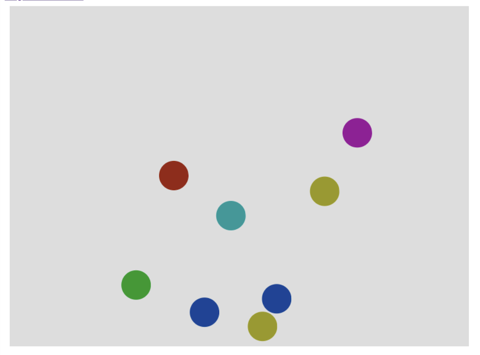

# JS1k 2010 Contributions

Submit any demo with maximum 1024 bytes of JavaScript.
I wrote a barcode renderer and an interactive 2D physics simulation.

https://oyo.github.com/js1k

run local

    npx http-server

open http://localhost:8080/
